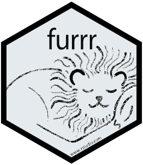

We're stoked to announce the release of [furrr](https://davisvaughan.github.io/furrr/) 0.2.0. furrr is a bridge between [purrr](https://purrr.tidyverse.org/)'s family of mapping functions and [future](https://cran.r-project.org/web/packages/future/index.html)'s parallel processing capabilities. It attempts to make mapping in parallel as seamless as possible.

You can install it from CRAN with:

<pre class='chroma'><code class='language-r' data-lang='r'><a href='https://rdrr.io/r/utils/install.packages.html'>install.packages</a>("furrr")
</code></pre>

This blog post will highlight a few of the key changes since the last release of furrr, which was over two years ago!

This release of furrr is also a complete rewrite of the original version. This should make furrr more maintainable going forward, and fixed a ton of minor bugs from the original release. You can see a full list of those changes in the [release notes](https://davisvaughan.github.io/furrr/news/index.html).

<pre class='chroma'><code class='language-r' data-lang='r'><a href='https://rdrr.io/r/base/library.html'>library</a>(<a href='https://github.com/DavisVaughan/furrr'>furrr</a>)
</code></pre>

Hex sticker
-----------

Perhaps most importantly, furrr now has a hex sticker! A big thanks to Dan Kuhn for creating this furrry little guy.

future\_walk()
--------------

furrr now includes a parallel version of [`purrr::walk()`](https://purrr.tidyverse.org/reference/map.html). This was a highly requested addition, and allows you to call `.f` for its side effects, like for rendering output to the screen or for saving files to disk.

<pre class='chroma'><code class='language-r' data-lang='r'>plan(multisession, workers = 2)

<a href='https://rdrr.io/pkg/furrr/man/future_map.html'>future_walk</a>(1:5, ~<a href='https://rdrr.io/r/base/print.html'>print</a>(<a href='https://rdrr.io/r/base/paste.html'>paste0</a>("Iteration: ", .x)))

#&gt; [1] "Iteration: 1"
#&gt; [1] "Iteration: 2"
#&gt; [1] "Iteration: 3"
#&gt; [1] "Iteration: 4"
#&gt; [1] "Iteration: 5"
</code></pre>

Vignettes
---------

There are a whopping 5 new vignettes detailing several frequently asked questions about furrr.

-   [Common gotchas](https://davisvaughan.github.io/furrr/articles/articles/gotchas.html)

-   [Learn how furrr "chunks" your input](https://davisvaughan.github.io/furrr/articles/articles/chunking.html)

-   [carrier - An alternative to automatic globals detection](https://davisvaughan.github.io/furrr/articles/articles/carrier.html)

-   [Progress notifications with progressr](https://davisvaughan.github.io/furrr/articles/articles/progress.html)

-   [Using furrr with remote connections](https://davisvaughan.github.io/furrr/articles/articles/remote-connections.html)

Progress bar update
-------------------

The above vignette regarding progress bars deserves a special mention. [Henrik Bengtsson](https://twitter.com/henrikbengtsson) (the author of the future and globals packages, which furrr would be nothing without) recently introduced a new package for generalized *progress updates*, [progressr](https://cran.r-project.org/web/packages/progressr/index.html). It has been integrated with future in such a way that it can relay near real-time progress updates from sequential, multisession, and even cluster futures (meaning that even remote connections can return live updates). This integration automatically extends to furrr, and looks a little like this:

<pre class='chroma'><code class='language-r' data-lang='r'><a href='https://rdrr.io/r/base/library.html'>library</a>(<a href='https://github.com/HenrikBengtsson/progressr'>progressr</a>)

plan(multisession, workers = 2)

x &lt;- <a href='https://rdrr.io/r/base/lapply.html'>replicate</a>(n = 10, <a href='https://rdrr.io/r/stats/Uniform.html'>runif</a>(20), simplify = FALSE)

<a href='https://rdrr.io/pkg/progressr/man/with_progress.html'>with_progress</a>({
  p &lt;- <a href='https://rdrr.io/pkg/progressr/man/progressor.html'>progressor</a>(steps = <a href='https://rdrr.io/r/base/length.html'>length</a>(x))
  
  result &lt;- <a href='https://rdrr.io/pkg/furrr/man/future_map.html'>future_map</a>(x, ~{
    p()
    <a href='https://rdrr.io/r/base/Sys.sleep.html'>Sys.sleep</a>(.2)
    <a href='https://rdrr.io/r/base/sum.html'>sum</a>(.x)
  })
})
#&gt; |=====================                                               |  20%
</code></pre>

progressr is a relatively new package, and this API isn't perfectly compatible with furrr and tidyverse workflows yet, but I'd encourage you to read the previously mentioned vignette about [progress notifications with progressr](https://davisvaughan.github.io/furrr/articles/articles/progress.html) to learn more. In the future, furrr will likely have an even tighter integration with progressr to make this even easier.

Along those lines, once furrr and progressr become more tightly integrated, the `.progress` bar of furrr will be removed. It has not been deprecated yet, but I would encourage you to go ahead and switch to using progressr, if possible. To be completely honest, the progress bar in furrr is a bit of a hack, and progressr provides a much more robust solution.

Options
-------

The [`future_options()`](https://rdrr.io/pkg/furrr/man/future_options.html) helper has been renamed in favor of [`furrr_options()`](https://rdrr.io/pkg/furrr/man/furrr_options.html). This change was made to free up this function name in case the future package requires it. Additionally, [`furrr_options()`](https://rdrr.io/pkg/furrr/man/furrr_options.html) has a number of new arguments, including one that allows you to further tweak how furrr "chunks" your input, `chunk_size`. If you are curious about this, read the new vignette on [chunking](https://davisvaughan.github.io/furrr/articles/articles/chunking.html).

Acknowledgements
----------------

We're very thankful to the 81 contributions that went into this release. In particular, a huge thanks to Henrik Bengtsson for his work on the future and globals packages that power furrr.

[@aaronpeikert](https://github.com/aaronpeikert), [@adrfantini](https://github.com/adrfantini), [@agilebean](https://github.com/agilebean), [@al-obrien](https://github.com/al-obrien), [@alexhallam](https://github.com/alexhallam), [@andrjohns](https://github.com/andrjohns), [@aornugent](https://github.com/aornugent), [@Ax3man](https://github.com/Ax3man), [@BChukwuSmith](https://github.com/BChukwuSmith), [@burchill](https://github.com/burchill), [@cipherz](https://github.com/cipherz), [@cwickham](https://github.com/cwickham), [@data-al](https://github.com/data-al), [@datawookie](https://github.com/datawookie), [@dhicks](https://github.com/dhicks), [@draben](https://github.com/draben), [@edavidaja](https://github.com/edavidaja), [@edgBR](https://github.com/edgBR), [@EdJeeOnGitHub](https://github.com/EdJeeOnGitHub), [@edvardoss](https://github.com/edvardoss), [@gadenbuie](https://github.com/gadenbuie), [@Gomesdrg](https://github.com/Gomesdrg), [@GShotwell](https://github.com/GShotwell), [@hadley](https://github.com/hadley), [@HanjoStudy](https://github.com/HanjoStudy), [@HenrikBengtsson](https://github.com/HenrikBengtsson), [@ignacio82](https://github.com/ignacio82), [@Ilia-Kosenkov](https://github.com/Ilia-Kosenkov), [@ivanhigueram](https://github.com/ivanhigueram), [@JanLauGe](https://github.com/JanLauGe), [@jmlondon](https://github.com/jmlondon), [@joethorley](https://github.com/joethorley), [@jschelbert](https://github.com/jschelbert), [@julou](https://github.com/julou), [@jzadra](https://github.com/jzadra), [@kendonB](https://github.com/kendonB), [@khvorov45](https://github.com/khvorov45), [@kimip24](https://github.com/kimip24), [@kkmann](https://github.com/kkmann), [@klahrich](https://github.com/klahrich), [@kurt1984](https://github.com/kurt1984), [@leungi](https://github.com/leungi), [@lrnv](https://github.com/lrnv), [@marcosci](https://github.com/marcosci), [@MatthieuStigler](https://github.com/MatthieuStigler), [@mattocci27](https://github.com/mattocci27), [@mattwarkentin](https://github.com/mattwarkentin), [@mikekaminsky](https://github.com/mikekaminsky), [@mikkeltp](https://github.com/mikkeltp), [@mikldk](https://github.com/mikldk), [@MokeEire](https://github.com/MokeEire), [@mpickard-niu](https://github.com/mpickard-niu), [@naglemi](https://github.com/naglemi), [@nick-youngblut](https://github.com/nick-youngblut), [@philerooski](https://github.com/philerooski), [@picousse](https://github.com/picousse), [@Plebejer](https://github.com/Plebejer), [@PMassicotte](https://github.com/PMassicotte), [@qpmnguyen](https://github.com/qpmnguyen), [@randomgambit](https://github.com/randomgambit), [@rcarboni](https://github.com/rcarboni), [@rlbarter](https://github.com/rlbarter), [@roman-tremmel](https://github.com/roman-tremmel), [@rossellhayes](https://github.com/rossellhayes), [@sefabey](https://github.com/sefabey), [@sheffe](https://github.com/sheffe), [@ShixiangWang](https://github.com/ShixiangWang), [@skalyan91](https://github.com/skalyan91), [@snp](https://github.com/snp), [@solomonsg](https://github.com/solomonsg), [@solunsteve](https://github.com/solunsteve), [@srvanderplas](https://github.com/srvanderplas), [@statist-bhfz](https://github.com/statist-bhfz), [@timvink](https://github.com/timvink), [@tklebel](https://github.com/tklebel), [@vincentarelbundock](https://github.com/vincentarelbundock), [@vrontosc](https://github.com/vrontosc), [@wenjia2018](https://github.com/wenjia2018), [@wjchulme](https://github.com/wjchulme), [@xiaodaigh](https://github.com/xiaodaigh), and [@yonicd](https://github.com/yonicd).

